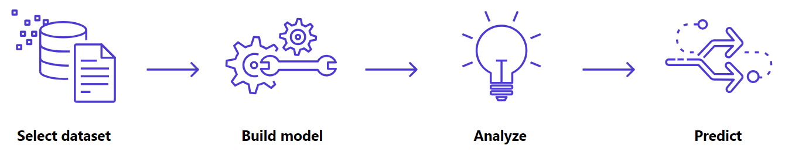

# 📊 Previsão de Estoque Inteligente com Amazon SageMaker Canvas

## Contexto do Projeto

Este projeto foi desenvolvido como parte do **Lab “Previsão de Estoque Inteligente na AWS com SageMaker Canvas”**, oferecido pela **Digital Innovation One (DIO)**.

O objetivo do desafio é explorar o **Amazon SageMaker Canvas**, uma ferramenta no-code da AWS, passando pelas principais etapas de um projeto de Machine Learning, desde a seleção dos dados até a análise dos resultados, sem necessidade de programação.

O foco principal não é criar um modelo altamente preciso, mas compreender o fluxo completo do Canvas e interpretar os resultados gerados.

> Este projeto foi desenvolvido a partir do repositório base disponibilizado pela DIO:  
> https://github.com/digitalinnovationone/lab-aws-sagemaker-canvas-estoque

---

## 🎯 Objetivo

Desenvolver um modelo de **Previsão de Estoque** utilizando **Machine Learning no-code**, capaz de identificar padrões temporais a partir de dados históricos e apoiar decisões relacionadas à reposição de estoque.

---

## 1. Seleção do Dataset

O dataset utilizado foi:

- **Nome:** `dataset-1000-com-preco-variavel-e-renovacao-estoque.csv`
- **Origem:** fornecido pela DIO no repositório  
  `lab-aws-sagemaker-canvas-estoque/datasets`
- **Quantidade de registros:** aproximadamente 1000 linhas

### Principais colunas do dataset:
- `ID_PRODUTO` → Identificador único do produto  
- `DATA_EVENTO` → Data do registro  
- `PRECO` → Preço do produto  
- `QUANTIDADE_ESTOQUE` → Quantidade do estoque
- Colunas relacionadas à variação e renovação de estoque  

O dataset foi selecionado por conter dados temporais, sendo adequado para um modelo de **Time Series Forecasting**.

Após a seleção, o arquivo foi importado diretamente no **Amazon SageMaker Canvas**.

---

## 2. Construção e Treinamento do Modelo

O modelo foi configurado no SageMaker Canvas com os seguintes parâmetros:

- **Tipo de modelo:** Time Series Forecasting  
- **Item ID:** `ID_PRODUTO`  
- **Time stamp:** `DATA_EVENTO`  
- **Forecast length:** 1 dia  
- **Build:** Quick Build  

O **Quick Build** foi escolhido por ser mais rápido e adequado ao uso da conta gratuita da AWS.

Após a configuração, o treinamento do modelo foi iniciado com sucesso.

---

## 3. Análise do Modelo

Após o treinamento, o SageMaker Canvas apresentou as seguintes métricas de desempenho:

| Métrica | Valor |
|------|------|
| Avg. wQL | 0.346 |
| MAPE | 0.971 |
| WAPE | 0.581 |
| RMSE | 36.006 |
| MASE | 0.852 |

### 🔺 Interpretação das métricas (visão simplificada)

- **RMSE (Root Mean Squared Error):**  
  Mede o erro médio das previsões em relação aos valores reais. Quanto menor, melhor. O valor obtido indica que o modelo possui margem de erro, aceitável para um projeto educacional.

- **MAPE (Mean Absolute Percentage Error):**  
  Representa o erro percentual médio das previsões. Valores mais próximos de zero indicam maior precisão.

- **WAPE (Weighted Absolute Percentage Error):**  
  Mede o erro absoluto ponderado, sendo relevante em cenários de previsão de demanda e estoque.

- **MASE (Mean Absolute Scaled Error):**  
  Permite comparar o modelo com uma previsão simples (baseline). Valores abaixo de 1 indicam que o modelo supera uma abordagem básica.

O Canvas também indicou que a variável **PREÇO** teve grande influência nas previsões, representando aproximadamente **60,54%**, evidenciando a relação entre preço e comportamento de estoque.

---

## 4. Previsão de Estoque

O modelo foi treinado com sucesso e está cumpre com seu papel em gerar previsões de estoque com base em dados históricos.

No entanto, devido às limitações da **conta gratuita da AWS**, não foi possível gerar previsões completas na etapa de *Predict* sem incorrer em custos adicionais.

Ainda assim, o processo permitiu:
- Entender como o SageMaker Canvas realiza previsões 
- A análise das métricas geradas e o impacto das variáveis
- Como o modelo poderia ser utilizado em um ambiente produtivo

---

## ⚠️ Limitações Encontradas

- Uso de conta **AWS Free Tier**
- Restrições na geração de previsões completas (*Predict*)
- Etapa de deploy não realizada para evitar custos

*Essas limitações não comprometem o aprendizado proposto pelo laboratório.*

---

## Conclusão

Este projeto proporcionou uma visão prática do fluxo completo de um projeto de **Machine Learning no-code**, passando pelas etapas de:

  

- Seleção de dados  
- Construção e treinamento do modelo  
- Análise de métricas  
- Interpretação dos resultados  

O Amazon SageMaker Canvas se mostrou uma ferramenta acessível para iniciantes, permitindo a criação de modelos de Machine Learning sem necessidade de programação, sendo uma excelente porta de entrada para projetos de ciência de dados.

---

## 👤 Autora

**Nome:** Vitória Alvares dos Santos

**Plataforma:** DIO 

## 🧠 Contexto do Projeto

Este projeto faz parte de um desafio prático da DIO, com foco na aplicação de **Machine Learning no-code** utilizando o **Amazon SageMaker Canvas**, simulando um cenário real de previsão de estoque e apoio à tomada de decisão.

---

## 🎯 Objetivo Pessoal

- Praticar Machine Learning sem código utilizando o SageMaker Canvas  
- Compreender o fluxo completo de criação de um modelo preditivo  
- Documentar o processo de forma clara para compor um portfólio no GitHub  
- Consolidar conhecimentos em AWS e análise de dados  

---

### Assinatura do Responsável pelo Projeto:
**Vitória Alvares dos Santos**   
**Bootcamp:** Nexa - Machine Learning e GenAI na Prática    
**Plataforma:** Digital Innovation One (DIO)

### Contatos:  
  
  

